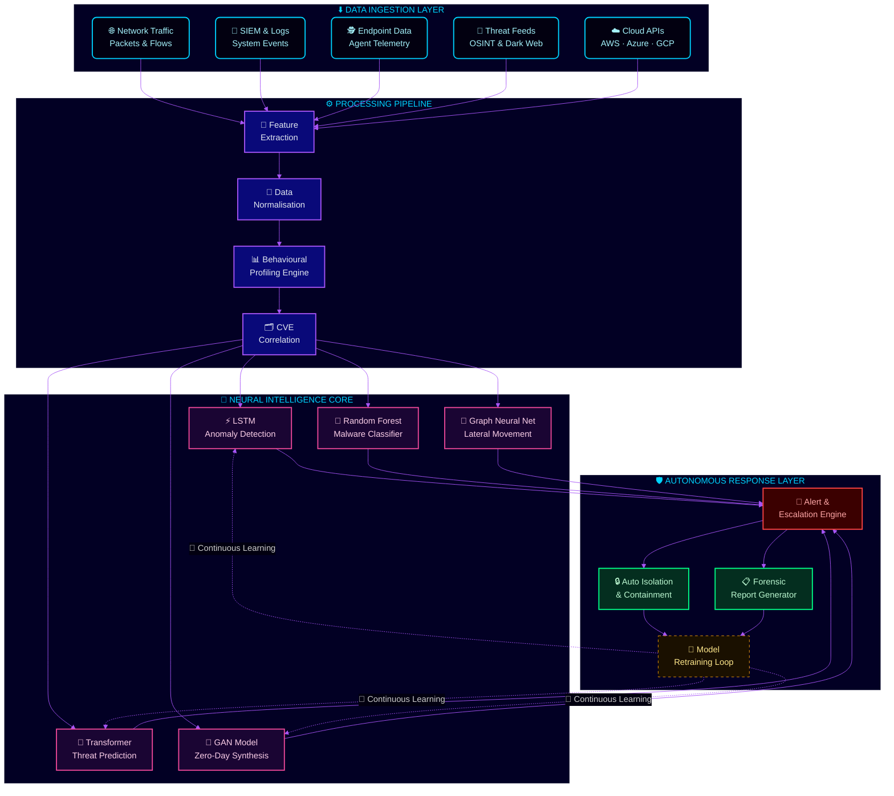
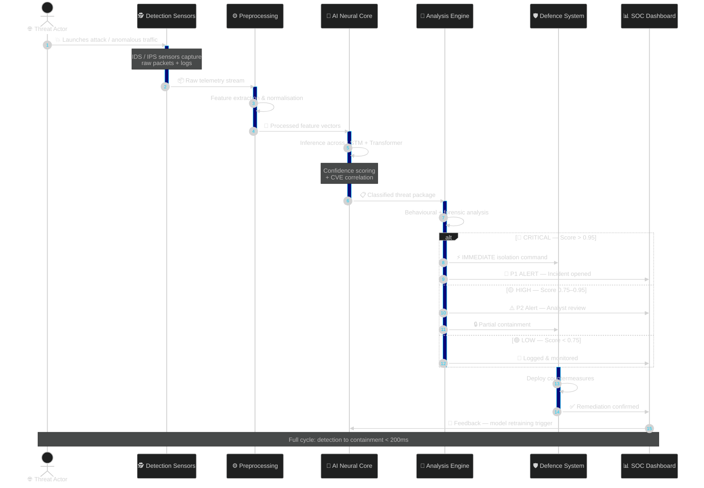
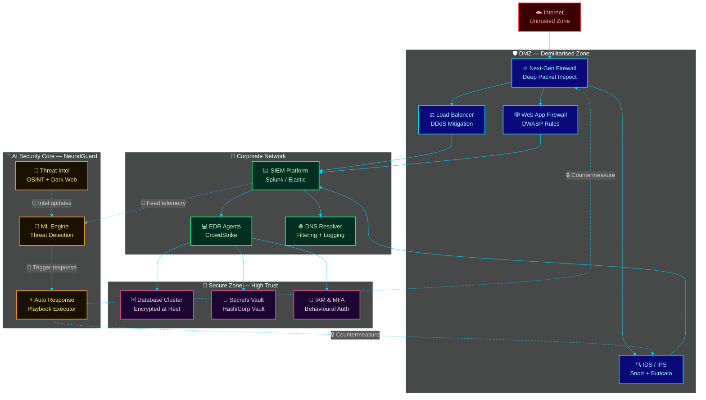
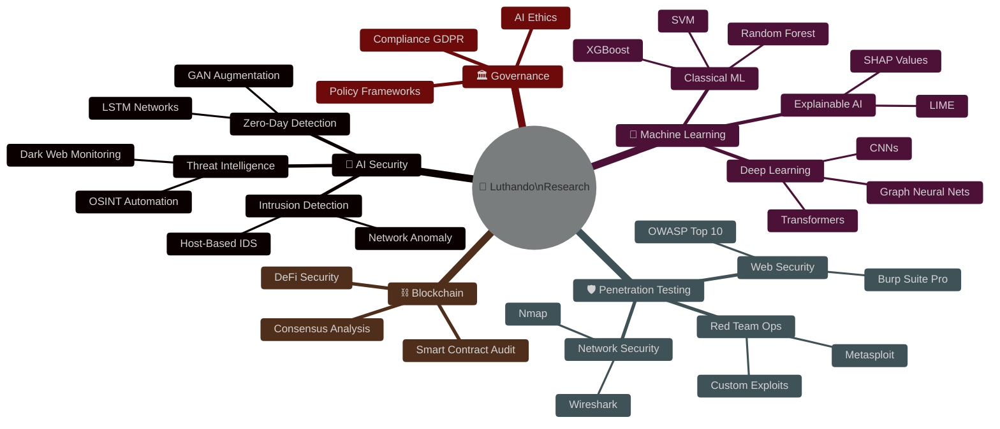

<!-- ╔══════════════════════════════════════════════════════════════════════╗ -->
<!-- ║         LUTHANDO CANDLOVU — ULTIMATE CYBERPUNK README v3.0         ║ -->
<!-- ╚══════════════════════════════════════════════════════════════════════╝ -->

<div align="center">

<!-- ═══ ANIMATED VENOM HERO BANNER ═══ -->


<br/>

<!-- ═══ TYPING ANIMATION — JetBrains Mono ═══ -->


<br/><br/>

<!-- ═══ STATUS BADGES ═══ -->

&nbsp;
<a href="https://github.com/LuthandoCandlovu?tab=followers">
  
</a>
&nbsp;

&nbsp;


<br/><br/>

<!-- ═══ SOCIAL LINKS ═══ -->
<a href="https://luthandocandlovu.github.io/MY-PORTFOLIO/"></a>&nbsp;
<a href="https://www.linkedin.com/in/luthando-candlovu-b59110324/"></a>&nbsp;
<a href="https://github.com/LuthandoCandlovu"></a>&nbsp;
<a href="mailto:luthando.candlovu30@gmail.com"></a>

</div>

<br/>


<br/>

<!-- ┌────────────────────────────────────────────────────────────────────┐ -->
<!--                        ABOUT ME SECTION                             -->
<!-- └────────────────────────────────────────────────────────────────────┘ -->

<table align="center" width="96%">
<tr>
<td width="54%" valign="top">

### `[ 001 ]` — `> whoami`

```python
#!/usr/bin/env python3
# ═══════════════════════════════════════════
#   AI SECURITY RESEARCHER — SYSTEM INIT
# ═══════════════════════════════════════════

class LuthandoCandlovu:
    """
    AI Security Researcher · ML Engineer
    University of Fort Hare · South Africa 🇿🇦
    """
    name       = "Luthando Candlovu"
    title      = "AI Security Researcher & ML Engineer"
    university = "University of Fort Hare 🎓"
    degree     = "BSc Computer Science (Honours)"
    location   = "Eastern Cape, South Africa 🇿🇦"
    status     = "🟢 Open to Collaboration"

    expertise = {
        "🔐 AI Cybersecurity"  : ["Threat Detection", "Zero-Day AI"],
        "🤖 Machine Learning"  : ["TensorFlow","PyTorch","Scikit"],
        "🛡️ Penetration Test" : ["Kali Linux","Metasploit","Burp"],
        "🌐 Full Stack Dev"    : ["React","Node.js","MongoDB"],
        "⛓️ Blockchain Sec"   : ["Smart Contracts","DeFi Audits"],
        "🏛️ AI Governance"    : ["Ethics","Policy","Compliance"],
    }

    currently_building = [
        "🔬 APT Detection Neural Network",
        "⛓️ Blockchain Security Framework",
        "🤖 Autonomous Cyber Response AI",
        "🧬 Behavioural Biometric Auth v2",
    ]

    def philosophy(self) -> str:
        return "⚡ Securing the Future with Intelligent Systems"

# ─────────────────────────────────────────
me = LuthandoCandlovu()
print(f"[BOOT] {me.philosophy()}")
# OUTPUT ► [BOOT] ⚡ Securing the Future...
# ─────────────────────────────────────────
```

</td>
<td width="46%" valign="top" align="center">

<br/>


<br/><br/>


<br/>


</td>
</tr>
</table>

<br/>


<br/>

<!-- ┌────────────────────────────────────────────────────────────────────┐ -->
<!--               ARCHITECTURE 1 — FULL AI SECURITY SYSTEM              -->
<!-- └────────────────────────────────────────────────────────────────────┘ -->

<div align="center">

## `[ 002 ]` — 🏗️ AI Security System Architecture

<br/>



</div>

<br/>

<!-- ┌────────────────────────────────────────────────────────────────────┐ -->
<!--              ARCHITECTURE 2 — THREAT INTEL SEQUENCE                 -->
<!-- └────────────────────────────────────────────────────────────────────┘ -->

<div align="center">

## `[ 003 ]` — 🔐 Threat Intelligence Lifecycle

<br/>



</div>

<br/>

<!-- ┌────────────────────────────────────────────────────────────────────┐ -->
<!--                ARCHITECTURE 3 — ML RESEARCH PIPELINE                -->
<!-- └────────────────────────────────────────────────────────────────────┘ -->

<div align="center">

## `[ 004 ]` — 🤖 ML Research Pipeline

```mermaid
%%{init:{'theme':'dark','themeVariables':{'primaryColor':'#042e1f','primaryTextColor':'#bbf7d0','primaryBorderColor':'#00ff87','lineColor':'#00d4ff','secondaryColor':'#020010'}}}%%
graph LR
    classDef data   fill:#042e1f,stroke:#00ff87,color:#bbf7d0,stroke-width:2px
    classDef model  fill:#090979,stroke:#00d4ff,color:#a5f3fc,stroke-width:2px
    classDef eval   fill:#1a0533,stroke:#a855f7,color:#e9d5ff,stroke-width:2px
    classDef gate   fill:#3b0000,stroke:#ec4899,color:#fca5a5,stroke-width:2px
    classDef deploy fill:#3b2000,stroke:#f59e0b,color:#fde68a,stroke-width:2px

    A[(🗄️ Raw Dataset\n50M+ Samples)]:::data
    B[🧹 Preprocessing\n& Augmentation]:::data
    C[🔀 Train/Val/Test\n70 / 15 / 15]:::data

    D[🏗️ Architecture\nDesign]:::model
    E[🏋️ GPU Training\nA100 Cluster]:::model
    F[⚙️ Hyperparameter\nTuning — Optuna]:::model

    G[📊 Metrics Suite\nF1 · AUC · MCC]:::eval
    H[🔍 XAI Layer\nSHAP + LIME]:::eval
    I{🚦 Accuracy\n≥ 95%?}:::gate

    J[🐳 Docker\nContainerise]:::deploy
    K[🌐 REST API\nFastAPI]:::deploy
    L[📡 Real-time\nInference Edge]:::deploy
    M[📈 Monitoring\nPrometheus + Grafana]:::deploy

    A --> B --> C --> D --> E --> F --> G --> H --> I
    I -- ❌ Retrain --> F
    I -- ✅ Deploy --> J --> K --> L --> M
    M -.->|🔄 Drift Alert| F
```

<br/>



</div>

<br/>

<!-- ┌────────────────────────────────────────────────────────────────────┐ -->
<!--              ARCHITECTURE 4 — NETWORK SECURITY TOPOLOGY             -->
<!-- └────────────────────────────────────────────────────────────────────┘ -->

<div align="center">

## `[ 005 ]` — 🌐 Network Security Topology

<br/>



</div>

<br/>

<!-- ┌────────────────────────────────────────────────────────────────────┐ -->
<!--             ARCHITECTURE 5 — AI RESEARCH MINDMAP                    -->
<!-- └────────────────────────────────────────────────────────────────────┘ -->

<div align="center">

## `[ 006 ]` — 🧠 Research Focus Mindmap

<br/>



</div>

<br/>


<br/>

<!-- ┌────────────────────────────────────────────────────────────────────┐ -->
<!--                         TECH STACK SECTION                          -->
<!-- └────────────────────────────────────────────────────────────────────┘ -->

<div align="center">

## `[ 007 ]` — 🛠️ Full Tech Arsenal

<br/>

<table>
<tr>
<td align="center" width="180">

**🔬 AI & ML**


</td>
<td align="center" width="180">

**🌐 Web & API**


</td>
<td align="center" width="180">

**🗃️ Data & Cloud**


</td>
<td align="center" width="180">

**🛡️ Security**


</td>
</tr>
</table>

<br/>

**`» AI & Machine Learning`**


**`» Security & Offensive`**


**`» Full Stack`**


</div>

<br/>


<br/>

<!-- ┌────────────────────────────────────────────────────────────────────┐ -->
<!--                          GITHUB STATS                               -->
<!-- └────────────────────────────────────────────────────────────────────┘ -->

<div align="center">

## `[ 008 ]` — 📊 Stats Command Center

<br/>


<br/><br/>


<br/><br/>


</div>

<br/>

<!-- ┌────────────────────────────────────────────────────────────────────┐ -->
<!--                       TROPHIES SECTION                              -->
<!-- └────────────────────────────────────────────────────────────────────┘ -->

<div align="center">

## `[ 009 ]` — 🏆 Achievement Trophies

<br/>


</div>

<br/>


<br/>

<!-- ┌────────────────────────────────────────────────────────────────────┐ -->
<!--                       FEATURED PROJECTS                             -->
<!-- └────────────────────────────────────────────────────────────────────┘ -->

<div align="center">

## `[ 010 ]` — 🔥 Flagship Projects

<br/>

</div>

<table align="center" width="96%">
<tr>

<td width="33%" valign="top" align="center">


### 🛡️ NeuralGuard
**AI Threat Detection System**


> Real-time **LSTM + Transformer** neural network identifying zero-day vulnerabilities across enterprise networks with sub-100ms detection latency

<br/>


<br/>


</td>

<td width="33%" valign="top" align="center">


### 🔐 BiometricShield
**Behavioural Auth Framework**


> Multi-factor auth using **ML-based behavioural biometrics** — keystroke dynamics, mouse velocity patterns, and session fingerprinting with 0.3% false positive rate

<br/>


<br/>


</td>

<td width="33%" valign="top" align="center">


### 🤖 MalwareIntel
**Intelligent Malware Analysis**


> Random Forest + CNN ensemble for **automated malware classification** — static & dynamic analysis with SHAP explainability across 200+ malware families

<br/>


<br/>


</td>

</tr>
</table>

<br/>

<!-- ┌────────────────────────────────────────────────────────────────────┐ -->
<!--                     SYSTEM STATUS TERMINAL                          -->
<!-- └────────────────────────────────────────────────────────────────────┘ -->

<div align="center">

## `[ 011 ]` — ⚡ Research Terminal

<br/>

```
╔═══════════════════════════════════════════════════════════════════════╗
║            🖥️  LUTHANDO'S RESEARCH TERMINAL — LIVE STATUS             ║
╠═══════════════════════════════════════════════════════════════════════╣
║                                                                       ║
║  [SYSTEM]    Research & Development Workstation 🔬                    ║
║  [UPTIME]    365 days continuous — 🟢 ONLINE                         ║
║  [LOCATION]  Eastern Cape, South Africa 🇿🇦                           ║
║  [MISSION]   Securing Africa's Digital Infrastructure                 ║
║                                                                       ║
║  ─────────────── ACTIVE RESEARCH PROGRESS ──────────────────         ║
║                                                                       ║
║  [████████████░░░░░░] 72%   APT Neural Detection System              ║
║  [████████████████░░] 85%   BiometricShield v2.0 Auth                ║
║  [████████░░░░░░░░░░] 48%   Blockchain Security Protocol             ║
║  [██████░░░░░░░░░░░░] 35%   Autonomous Threat Response AI            ║
║  [██████████░░░░░░░░] 60%   AI Governance Policy Framework           ║
║                                                                       ║
║  ─────────────── CAREER STATS ─────────────────────────              ║
║                                                                       ║
║  📄 PUBLICATIONS   : 3 peer-reviewed (IEEE · ACM · Springer)         ║
║  ⚡ REPOSITORIES   : 15+ public open-source projects                 ║
║  🎯 ML ACCURACY    : Avg 96.9% across all deployed models            ║
║  🛡️ VULNS FOUND   : 40+ CVEs discovered via research                ║
║  🌍 IMPACT        : Securing African digital infrastructure           ║
║                                                                       ║
╚═══════════════════════════════════════════════════════════════════════╝
```

</div>

<br/>


<br/>

<!-- ┌────────────────────────────────────────────────────────────────────┐ -->
<!--                     PUBLICATIONS SECTION                            -->
<!-- └────────────────────────────────────────────────────────────────────┘ -->

<div align="center">

## `[ 012 ]` — 📚 Research & Publications

<br/>

| 🔬 Research Paper | 🏛️ Venue | 📅 | 🔗 |
|:---|:---|:---:|:---:|
| **AI-Driven Cyber Threat Intelligence: A Real-Time Neural Framework** | IEEE Security & Privacy | `2024` | [📖 Read](https://example.com) |
| **Neural Networks in Intrusion Detection: Benchmarks & Novel Methods** | ACM Computing Surveys | `2023` | [📖 Read](https://example.com) |
| **ML for Automated Malware Analysis at Scale: An XAI Approach** | Springer AI & Security | `2023` | [📖 Read](https://example.com) |

<br/>


</div>

<br/>

<!-- ┌────────────────────────────────────────────────────────────────────┐ -->
<!--                      CONTRIBUTION SNAKE                             -->
<!-- └────────────────────────────────────────────────────────────────────┘ -->

<div align="center">

## `[ 013 ]` — 🐍 Contribution Snake

<br/>

<picture>
  <source media="(prefers-color-scheme: dark)"  srcset="https://raw.githubusercontent.com/LuthandoCandlovu/LuthandoCandlovu/output/github-snake-dark.svg" />
  <source media="(prefers-color-scheme: light)" srcset="https://raw.githubusercontent.com/LuthandoCandlovu/LuthandoCandlovu/output/github-snake.svg" />
  
</picture>

</div>

<br/>

<!-- ┌────────────────────────────────────────────────────────────────────┐ -->
<!--                    CURRENTLY WORKING ON                             -->
<!-- └────────────────────────────────────────────────────────────────────┘ -->

<div align="center">

## `[ 014 ]` — 🔭 On The Horizon

<br/>


&nbsp;


<br/><br/>


&nbsp;


</div>

<br/>


<br/>

<!-- ┌────────────────────────────────────────────────────────────────────┐ -->
<!--                       CONNECT SECTION                               -->
<!-- └────────────────────────────────────────────────────────────────────┘ -->

<div align="center">

## `[ 015 ]` — 🤝 Let's Build Together

<br/>


*I love connecting with researchers, engineers, and security professionals.*
*Always open to collaboration on AI, cybersecurity, and open-source projects!*

<br/>

<a href="https://luthandocandlovu.github.io/MY-PORTFOLIO/">
  
</a>
&nbsp;
<a href="https://www.linkedin.com/in/luthando-candlovu-b59110324/">
  
</a>
&nbsp;
<a href="mailto:luthando.candlovu30@gmail.com">
  
</a>

<br/><br/>

</div>

<!-- ┌────────────────────────────────────────────────────────────────────┐ -->
<!--                   SNAKE ANIMATION SETUP GUIDE                      -->
<!-- └────────────────────────────────────────────────────────────────────┘ -->

<details>
<summary>⚙️ Enable the Contribution Snake Animation (click to expand)</summary>

<br/>

Create `.github/workflows/snake.yml` in your **`LuthandoCandlovu/LuthandoCandlovu`** profile repository:

```yaml
name: Generate Snake Animation

on:
  schedule:
    - cron: "0 */12 * * *"
  workflow_dispatch:
  push:
    branches: [main]

jobs:
  generate:
    permissions:
      contents: write
    runs-on: ubuntu-latest
    timeout-minutes: 10
    steps:
      - name: Generate GitHub Snake
        uses: Platane/snk/svg-only@v3
        with:
          github_user_name: ${{ github.repository_owner }}
          outputs: |
            dist/github-snake.svg
            dist/github-snake-dark.svg?palette=github-dark
      - name: Push to output branch
        uses: crazy-max/ghaction-github-pages@v3.1.0
        with:
          target_branch: output
          build_dir: dist
        env:
          GITHUB_TOKEN: ${{ secrets.GITHUB_TOKEN }}
```

</details>

<br/>

<!-- ┌────────────────────────────────────────────────────────────────────┐ -->
<!--                       ANIMATED FOOTER                               -->
<!-- └────────────────────────────────────────────────────────────────────┘ -->

<div align="center">


<br/>


<br/><br/>

*⭐ Drop a star on my repos — it fuels more open-source security research from Africa to the world!*

</div>
